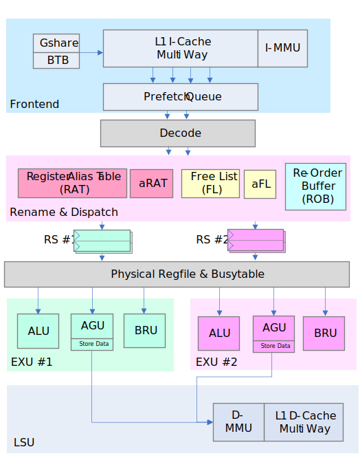

# nano-cpu32k

nano-cpu32k (ncpu32k) is a high-performance RISC processor core.

|  Feature  | `nano-cpu32k` |
|:------:|:------:|
| Superscalar   | √ |
| Out-of-order issue/execution   | √ |
| Boot Linux | √ |
| L1 Cache & MMU | √ |
| AXI4 Memory interface  | √ |
| Instruction fetch width | 4 (Configurable) |
| Issue width     | 2 (Configurable) |
| Dynamic branch prediction   | √ |
| Synthesizable Verilog  | √ |
| FPGA Verified  | √ |
| Clock frequency on FPGA  | 100+MHz |

The micro-architecture overview is shown below.



## Generate Verilog
* Install `python3`.
* Run `make build` to generate the Verilog file `build/ysyx_210479.v`

## Run Linux with simulator

* Install Verilog simulator `Verilator`.
* Run `make build_sim` to generate the simulation program `build/emu`.
* Run `build/emu --help` for a overview of supported options.

Now run Linux:
```bash
./build/emu --mode=standalone -b ./prebuilt/vmlinux.bin --flash-image=./prebuilt/bsp/program/flash/trampoline-flash.bin --reset-pc=0x30000000
```

Using  `--mode=difftest` option, you could do **differential test** between hardware implementation and C++ reference model.

## Run regression testing

* Run `run-test.sh`.

## Run Linux on Xilinx Kintex-7 FPGA

A DDR3-based minimum SoC is available at `fpga\ddr3_alpha_soc` in the form of Vivado project.

* See `fpga\ddr3_alpha_soc\PINs.xlsx` for hardware connection details.
* Program the SPI flash with binary file `prebuilt\bsp\program\loader\vmlinux-loader.bin` starting at address 0x0.
* Connect the RS232 serial port to your PC, set baud rate as 115200.
* Power on, program the FPGA and then reset.

## Software resources
* [Patches for GNU Toolchain](https://github.com/cassuto/nano-cpu32k-toolchain)
* [Linux Kernel](https://github.com/cassuto/nano-cpu32k-linux-4.20.8)

